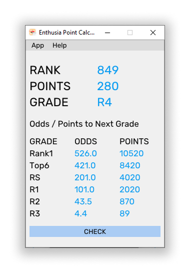
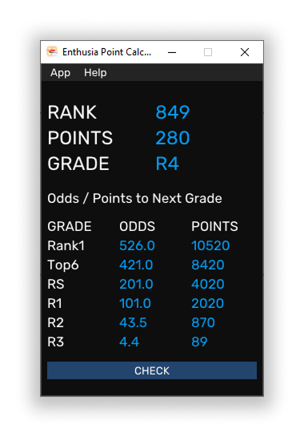
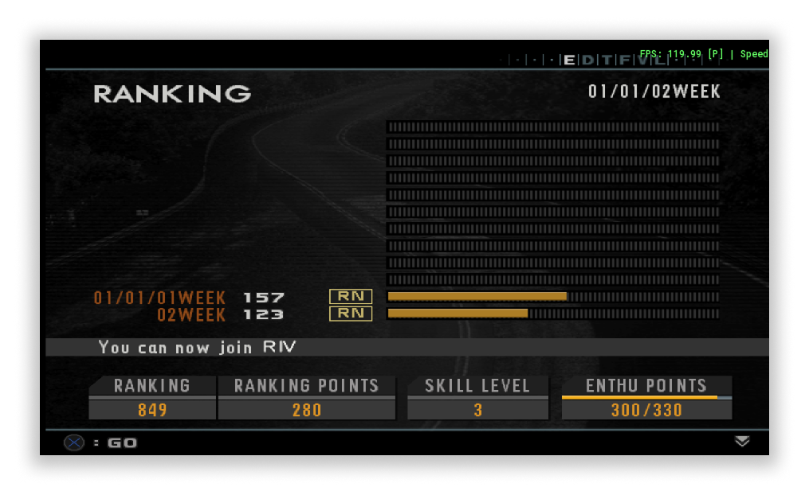

# Enthusia Point Calculator

A simple tool that helps in calculating minimum amount of points or odds required to reach next rank.

This is meant to reduce mental math pressure in a casual run or even a speedrun.

# Features
- Manual running
- Auto running
- Light And Dark Mode
- Toggle to include RS Points or exclude them

# Requirements
- Windows (currently not supported on Linux or macOS)
- DirectX (Required for GUI)
- PCSX2
- Enthusia Professional Racing (US COPY ONLY)

# Usage
- Download the `.exe` from the `Releases` tab of GitHub
- Before opening the program, open PCSX2 and open the game in `PCSX2`
- If you are using manual checking, a `CHECK` button will appear. This only shows results when you are on the screen below
- 
- Please note that this screen only appears after you finish a race. This does NOT work with resting.
- To use autorun, go to `File > Auto Run` and check that.
	- It should now make the `CHECK` button disappear, and it should autorun
	- **PLEASE NOTE TO DISABLE AUTORUN AFTER YOU FINISH WITH THE RUN. ALSO CLOSE THE PROGRAM BEFORE CLOSING PCSX2**

# Limitations
- R5 to R4 detection is unsupported. So the program does not know if you are in R5.

# Issues
There are some known issues that may occur while using this program. Some of them are
- Very minor slowdowns (very rare) but this should not be much of an issue

# Notes
- **PLEASE NOTE TO OPEN OPEN THIS PROGRAM AFTER PCSX2 LAUNCHES AND TO CLOSE IT BEFORE CLOSING PCSX2**
- In Enthusia, the way of league qualifications is below (taken from [Enthusia Speedrunning Guide Document](https://docs.google.com/document/d/1jX8PJZ2lZpuxxPWasJbqe8-HDl9FXBfmXOCUV5JHRO0/edit?tab=t.0)
	- RN: Always unlocked
	- RIV: Always unlocked after winning 2 RN races or completing 5 RN races (whichever comes first)
	- RIII: Be in the top 800 (369 Points)
	- RII: Be in the top 500 (1150 Points)
	- RI: Be in the top 300 (2300 Points)
	- RS: Be in the top 50 (4300 Points), except for King of the Year Grand Prix.
	- Top 6: This is required at the start of December Week 4 for King of the Year, and is obtained when you have at least 8700 Points.
	- Rank #1: Reach 10800 Points to obtain this rank.
- Base scores per league are as follows
	- RN: 10
	- RIV: 20
	- RIII: 50
	- RII: 100
	- RI: 200
	- RS: 500
- This program only notes for race finish of 1st place. Other Race Finish Position Points Multipliers for the Six-Car Races.
	- 1st: 1x
	- 2nd: 0.6x
	- 3rd: 0.4x
	- 4th: 0.2x (Placing here or better yields the chance for a prize car)
	- 5th and 6th: You get no Ranking Points.

# Method Of Working
The program uses WinAPI to hook to PCSX2 EEmem and read the values from there.

Because of this, this is only supported on Windows as of current.

# Build
As this is a `Visual Studio 2026` project, you need that and atleast `MSVC + tools` and `Windows SDK`.

Open the `.slnx` solution file, and build the program.

As I am not well versed with `CMake` or other building tools, I do not know how well it will work using other systems.